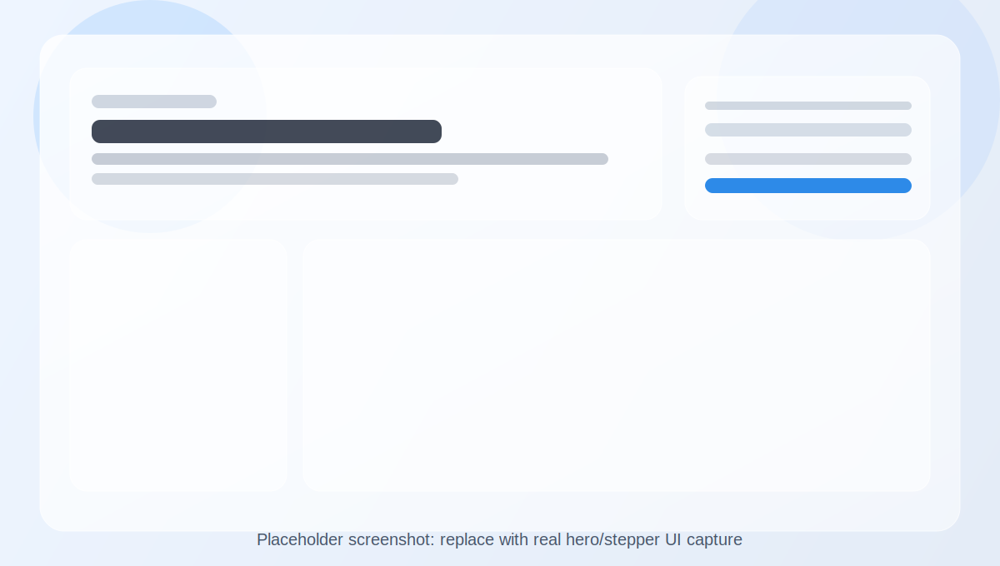
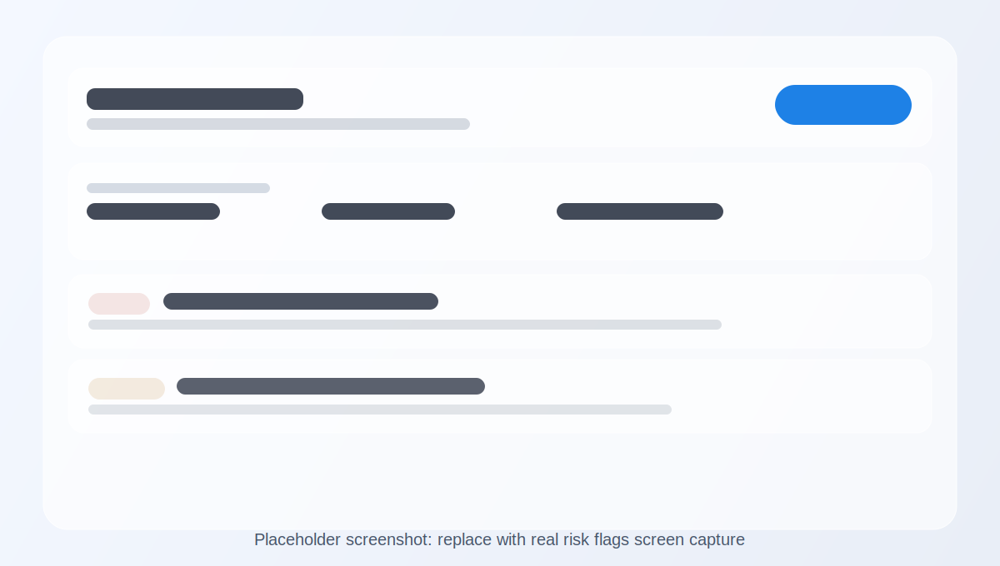

# AI IRB Copilot (MVP)

IRB preparation assistant for research studies involving human participants (especially classroom / AI-grading contexts).

This tool is for:

- rule-based IRB pre-screening
- draft language generation (`consent`, `recruitment`, `data handling`)
- AI-assisted rewriting (`less coercive`, `clearer`)
- draft packet export for advisor/IRB review

It is **not** an IRB approval system.

## Demo Screens (Placeholders - Replace With Real Screenshots)

These placeholders are wired into the README so you can quickly swap in real screenshots later.





Recommended real screenshots to replace with:

1. Hero + stepper + progress bar
2. Risk Flags screen with summary + cards
3. Drafting Studio with generated consent text

## What It Does

1. `Project Intake`
- Collects study title, institution, course context, methods, and plain-language purpose
- Supports profile import from school/organization name, optional website/IRB URL, or pasted policy text

2. `Recruitment & Participants`
- Captures participant groups, recruiter role, voluntariness, extra credit, minors, grade impact

3. `Data & Privacy`
- Captures identifiers, education records, de-identification, storage/access/retention

4. `Rule-Based Risk Flags`
- Flags common IRB concerns (coercion, FERPA risk, grade impact, missing safeguards)

5. `Drafting Studio`
- Generates drafts for:
  - `consent`
  - `recruitment`
  - `data handling`
- Rewrites text to be:
  - `Less Coercive`
  - `Clearer`
- Exports a draft bundle (`.txt`) after a human-review acknowledgment

6. `IRB Profile Importer`
- Generates a draft institution profile from school/organization details
- Extracts requirement signals (training, consent templates, recruitment materials, data security, FERPA, etc.)
- Returns confidence, warnings, source links, and detected form/template links
- Lets users apply the imported profile directly in the UI for readiness checks

## Stack (Current MVP)

- `Python stdlib` backend (`server.py`)
- `HTML/CSS/JS` frontend (`static/`)
- Optional `OpenAI API` integration for drafting/rewriting
- Local browser `localStorage` persistence (no DB yet)

## Quick Start (Local)

Requirements: `Python 3.10+`

```bash
cd /Users/stanfeng/Documents/IRB-Agent
python3 server.py
```

Open:

- [http://127.0.0.1:8000](http://127.0.0.1:8000)

### Optional: Enable AI Drafting/Rewriting

```bash
export OPENAI_API_KEY="your_key_here"
export OPENAI_MODEL="gpt-4.1-mini"   # optional
python3 server.py
```

Without an API key, the app runs in `template fallback` mode (still fully usable for demos/workflow testing).

## Demo Script (For Professor / IRB Office Conversation)

Use this flow during a live demo:

1. Open the app and show `template fallback` vs `AI API connected` status in the top banner.
2. Fill in a realistic AI-grading study scenario with student participants and course context.
3. Set recruiter role to `instructor` and enable `extra credit` without alternative to trigger high-severity flags.
4. Run `IRB Risk Flags` and explain the deterministic (rule-based) concerns surfaced.
5. Move to `Drafting Studio` and generate all drafts.
6. Use `Less Coercive` on the recruitment draft and show how wording is revised.
7. Check the human-review acknowledgment box and export the draft bundle.
8. Emphasize that the tool prepares materials but does not approve IRB submissions.

Optional importer demo add-on:

9. In Step 1, run the profile importer with school name + IRB URL (or pasted policy text).
10. Show confidence/warnings and apply the imported profile.
11. Re-run readiness check to show institution-specific attachment expectations.

## Repository Structure

- `/Users/stanfeng/Documents/IRB-Agent/server.py` - local API server + rule engine + optional AI calls
- `/Users/stanfeng/Documents/IRB-Agent/static/index.html` - UI structure
- `/Users/stanfeng/Documents/IRB-Agent/static/styles.css` - glass UI + motion
- `/Users/stanfeng/Documents/IRB-Agent/static/app.js` - wizard logic, API calls, draft workflow
- `/Users/stanfeng/Documents/IRB-Agent/static/config.js` - frontend API base URL config (for split deployment)
- `/Users/stanfeng/Documents/IRB-Agent/render.yaml` - Render backend blueprint
- `/Users/stanfeng/Documents/IRB-Agent/.github/workflows/deploy-pages.yml` - GitHub Pages frontend deploy
- `/Users/stanfeng/Documents/IRB-Agent/DEPLOYMENT.md` - step-by-step hosting guide

## Deployment Options

### Option A: One Service (Simplest)

Deploy the whole app (`frontend + backend`) on a single Python host (Render/Railway/Fly/VM).

Pros:

- easiest setup
- no CORS configuration needed
- one URL for users

### Option B: GitHub Pages (Frontend) + Render (Backend)

This repo now supports a split deployment:

- `GitHub Pages` serves `static/` as the frontend
- `Render` hosts the Python API (`/api/*`)

Important:

- Set `CORS_ALLOW_ORIGINS` on the backend (e.g., `https://soymilkchicken.github.io`)
- Set the frontend API base URL in `/Users/stanfeng/Documents/IRB-Agent/static/config.js` (or via the `PAGES_API_BASE_URL` GitHub secret for the Pages workflow)

See `/Users/stanfeng/Documents/IRB-Agent/DEPLOYMENT.md` for exact steps.

## Validity / Safety Notes

- Outputs are valid as `drafts`, not guaranteed IRB-ready submissions.
- Institution-specific forms and policies still need manual review.
- Final review by PI/faculty advisor + IRB office is required.

## Current MVP Limits

- No authentication / multi-user support
- No database persistence (local browser only)
- No institution-specific IRB form mapping
- No upload/parse of IRB PDFs yet
- No direct IRB portal submission

## Suggested Next Steps

1. Add readiness checks (required fields + placeholder detection before export)
2. Add institution-specific IRB form mapping (field-by-field)
3. Add project persistence (Postgres/Supabase)
4. Add diff view and version history for rewrites
5. Add advisor review workflow + comments
